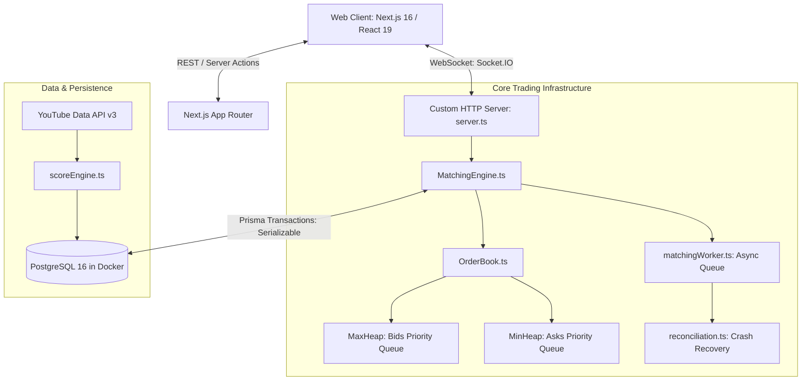

# 📈 YouTube Creator Stock Exchange (YT Market)

[](https://github.com/aerinpatel/YT_market_main/actions/workflows/ci.yml)
[](https://nextjs.org/)
[](https://www.prisma.io/)
[](https://www.typescriptlang.org/)
[](https://www.docker.com/)

A high-concurrency, real-time quantitative trading exchange where users can trade fractional public shares in YouTube creators. Built with a custom in-memory **Limit Order Book** using binary heaps, atomic transaction settlement, real-time WebSocket distribution, and fundamental metric valuation ingestion from the YouTube Data API v3.

---

## 🏛 System Architecture



---

## 🚀 Key Technical Highlights

### 1. In-Memory Limit Order Book ($O(\log N)$ Priority Queues)
- Implemented customized **MinHeap** and **MaxHeap** data structures (`lib/engine/Heap.ts`) enforcing strict **Price-Time Priority (FIFO)**.
- Continuous real-time aggregated market depth calculation across bid and ask levels.
- Supports both **LIMIT** and **MARKET** orders with full and partial fill execution.

### 2. Financial Precision & Concurrency Guarantees
- **Decimal Precision**: All currency balances and valuations are persisted using PostgreSQL `Decimal(14,2)` and `BigInt` for volume quantities to completely eliminate floating-point rounding discrepancies.
- **ACID Transactions**: Order settlement, position transfers, and wallet balance adjustments execute within atomic `prisma.$transaction` blocks with strict isolation.
- **Self-Trade Prevention**: Rejects wash-trading attempts where a trader's buy and sell orders match.

### 3. Real-Time Streaming Architecture
- Built with a custom unified HTTP + Socket.IO server (`server.ts`).
- Broadcasts granular market events: `orderbook_update`, `trade_executed`, and `ticker_update`.
- Private rooms stream real-time fill confirmations and wallet balance adjustments directly to authenticated users.

### 4. YouTube Fundamental Valuation Engine
- Ingests verified subscriber counts, lifetime views, total likes, and comments from YouTube Data API v3.
- Blended valuation algorithm accounts for:
  - Total reach (logarithmic milestone scaling).
  - Audience engagement ratios (likes + comments per view).
  - Upload consistency heuristic based on posting cadence.

---

## 🛠 Tech Stack

- **Frontend**: Next.js 16 (App Router), React 19, Tailwind CSS v4, Lucide React
- **Backend**: Node.js, Custom HTTP / Express server, Socket.IO 4.8
- **Database & ORM**: PostgreSQL 16 (Dockerized), Prisma ORM 6.4.1
- **DevOps & CI/CD**: Docker, Docker Compose, GitHub Actions CI Pipeline

---

## 📦 Getting Started

### Prerequisites
- Node.js 20+
- Docker Desktop

### 1. Clone & Install
```bash
git clone https://github.com/aerinpatel/YT_market_main.git
cd YT_market_main
npm install --legacy-peer-deps
```

### 2. Start PostgreSQL Container
```bash
docker compose up -d
```

### 3. Setup Database Schema
```bash
npx prisma db push
npx prisma generate
```

### 4. Run Development Server
```bash
npm run dev
```
Visit [http://localhost:3000](http://localhost:3000).
